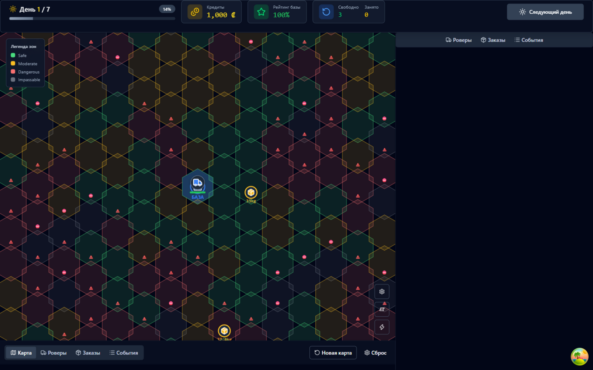
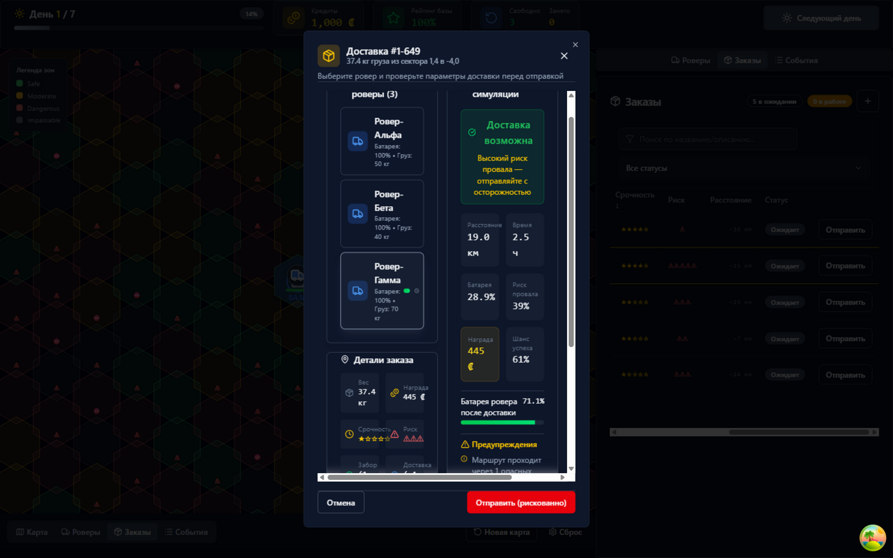

# Moon Courier Crisis

Игровой симулятор лунной доставки. Управляйте флотом роверов, доставляйте грузы по процедурно генерируемой карте Луны, учитывайте вес, батарею, риск зон и зарабатывайте кредиты.

## 🚀 Быстрый запуск

### Через Docker Compose (рекомендуется)

```bash
# Скачать репозиторий и зайти в терминал
cd Moon-Courier-Crisis-main

# Запустить всё одной командой
docker-compose up --build
```

- Фронтенд: http://localhost:5173
- Бэкенд API: http://localhost:8000
- Документация API: http://localhost:8000/docs

### Локально (без Docker)

**Бэкенд:**
```bash
cd backend
python -m venv venv
pip install -r requirements.txt
uvicorn app.main:app --reload
```

**Фронтенд:**
```bash
cd frontend
npm install
npm run dev
```

## 🎮 Как играть

1. **Карта Луны** — процедурно генерируется при старте (радиус 8 гексов от базы)
2. **Зоны риска:**
   - 🟢 Безопасная — нормальная скорость, низкий риск
   - 🟡 Умеренная — скорость -10%, бат. +20%, риск x1.5
   - 🔴 Опасная — скорость -30%, бат. +50%, риск x3
   - ⚫ Непроходимая — нельзя пройти
3. **Роверы** — имеют батарею, грузоподъёмность, скорость, эффективность
4. **Заказы** — вес, награда, срочность (1-5), риск (1-5), точки забора/доставки
5. **Доставка (двухфазная):**
   - Выберите заказ → выберите ровер → нажмите «Отправить»
   - Симуляция покажет путь, расход батареи, время, шанс успеха
   - Ровер уходит в рейс (статус «Доставка»), исход бросается **в конце дня**
   - Успех: заказ доставлен, кредиты начислены, ровер на базе
   - Провал: заказ провален, рейтинг -5; ровер возвращается лишний день, а с шансом 25% теряется безвозвратно
   - Тяжёлый груз → больше расход батареи, ниже шанс успеха
   - Недостаточно батареи / грузоподъёмности / путь заблокирован = доставка невозможна
6. **Следующий день** — подводятся итоги рейсов, роверы на базе заряжаются (+30% + бонусы апгрейдов), сломанные роверы чинятся (1–3 дня), генерируются новые заказы, происходит случайное событие
7. **Срочные заказы** (срочность 4–5) нужно назначить в тот же день, иначе они сгорают (рейтинг -5)
8. **Цель** — выжить 7 дней, максимизировать кредиты, не дать рейтингу базы упасть до 0

## 🏗 Архитектура

```
moon-courier-crisis/
├── backend/                 # FastAPI + SQLAlchemy + SQLite
│   ├── app/
│   │   ├── main.py         # FastAPI app, CORS, routes
│   │   ├── database.py     # SQLAlchemy engine, session
│   │   ├── models.py       # ORM модели (Zone, Rover, Order, Delivery, GameState, Event)
│   │   ├── schemas.py      # Pydantic схемы для API
│   │   ├── routes.py       # REST эндпоинты
│   │   ├── game_logic.py   # Игровая логика (A*, расчёт доставки, события)
│   │   └── hex_utils.py    # Hex grid утилиты (axial coords, pathfinding)
│   ├── requirements.txt
│   └── Dockerfile
├── frontend/                # React + TypeScript + Vite
│   ├── src/
│   │   ├── components/
│   │   │   ├── game/       # HexMap, RoverPanel, OrderPanel, EventLog, SimulationModal, GameHeader
│   │   │   └── ui/         # Button, Card, Badge, Progress, Table, Select, Input, Dialog, Toast, Tabs, ScrollArea
│   │   ├── store/          # Zustand store с persist
│   │   ├── lib/            # api.ts, hex.ts, utils.ts
│   │   ├── hooks/          # use-toast.ts
│   │   ├── types/          # TypeScript типы
│   │   ├── App.tsx
│   │   └── main.tsx
│   ├── package.json
│   └── Dockerfile
├── docker-compose.yml
└── .github/workflows/ci.yml
```

## 🔧 Игровая логика (backend/app/game_logic.py)

### Расчёт доставки `calculate_delivery(rover, order, zones)`

1. **Проверки:**
   - Вес ≤ грузоподъёмность ровера
   - Статус ровера = IDLE
   - Путь существует (A* через проходимые зоны)

2. **Путь:** Base → Pickup → Delivery → Base (A* с весами зон)

3. **Батарея:**
   - Базовый расход: 1% за гекс
   - Множитель веса: `1.0 + (weight / max_cargo) * 0.5` (макс +50%)
   - Множитель зоны: safe=1.0, moderate=1.2, dangerous=1.5
   - Эффективность ровера: `/ efficiency`
   - Нужен запас 10%

4. **Время:** `гексы / (speed * zone_speed_modifier)`

5. **Шанс успеха:**
   - База: 95%
   - Штраф риска: `min(risk_accumulator * 0.02, 0.4)`
   - Штраф веса: `(weight / max_cargo) * 0.1`
   - Штраф низкой батареи: `max(0, (1 - battery/max) * 0.15)`
   - Итог: `clamp(0.1, 0.99)`

### Невозможные доставки
- Вес > грузоподъёмности
- Ровер не IDLE
- Нет пути (зона IMPASSABLE блокирует)
- Батареи не хватает даже с запасом 10%

### Случайные события (каждый день, шанс растёт)
- Пыльная буря — скорость всех роверов -30% и шанс успеха -10% на день
- Солнечная вспышка — случайный сектор становится опасным на день
- Поломка ровера — статус «Сломан», ремонт на базе 1–3 дня (по счётчику)
- Приоритетный заказ — реально создаётся заказ с двойной наградой и срочностью 5
- Метеорит — создаёт новую IMPASSABLE зону навсегда
- Апгрейд базы — +10% к зарядке в день (накапливается до +50%)

## 📊 API Эндпоинты

| Метод | Путь | Описание |
|-------|------|----------|
| GET | `/api/zones` | Все зоны карты |
| POST | `/api/zones/generate` | Генерация новой карты |
| GET | `/api/rovers` | Список роверов |
| POST | `/api/rovers` | Создать ровер |
| PATCH | `/api/rovers/{id}` | Обновить ровер |
| POST | `/api/rovers/{id}/charge` | Зарядить на базе |
| GET | `/api/orders` | Список заказов |
| POST | `/api/orders` | Создать заказ |
| POST | `/api/delivery/simulate` | Симуляция доставки |
| POST | `/api/delivery/assign` | Отправить ровер в рейс (исход — в конце дня) |
| GET | `/api/game/state` | Состояние игры |
| POST | `/api/game/next-day` | Следующий день (итоги рейсов, события) |
| POST | `/api/game/reset` | Сброс игры (новая случайная карта) |
| GET | `/api/events` | Журнал событий |
| GET | `/api/stats` | Статистика |

## 🧪 Тестирование

```bash
# Backend тесты
cd backend
pytest -v

# Frontend тесты
cd frontend
npm test
```

## 📝 CI/CD

GitHub Actions (`.github/workflows/ci.yml`):
- Backend: ruff lint, mypy typecheck, pytest
- Frontend: eslint, tsc, vitest, build
- Docker: сборка образов при пуше в main

## 🛠 Используемые технологии

**Backend:** FastAPI, SQLAlchemy 2.0, Pydantic 2, SQLite, Uvicorn
**Frontend:** React 18, TypeScript, Vite, TanStack Query, Zustand, Tailwind CSS, Radix UI, Framer Motion, Lucide React
**DevOps:** Docker, Docker Compose, GitHub Actions

## 📸 Скриншоты

| Карта и панели | Симуляция доставки |
|---|---|
|  |  |


## 🤖 Использование AI

В разработке проекта использовались AI-ассистенты (Z.ai и Claude):

- **Генерация кода** — каркас приложения (FastAPI-роуты, SQLAlchemy-модели, React-компоненты, hex-рендер карты) написаны с помощью AI по словесному описанию задачи.
- **Игровая логика** — AI предложил структуру расчёта доставки (батарея/вес/зоны, A* с весами зон) и формулы шанса успеха; формулы затем настраивались вручную.
- **Рефакторинг и отладка** — с помощью AI найдены и исправлены баги: детерминированная «процедурная» карта из-за глобального `random.seed()`, декоративные события без эффектов, мгновенная синхронная доставка.
- **Тесты** — часть юнит-тестов (pytest/vitest) сгенерированы AI и отредактированы человеком.

Вся логика проверялась и дорабатывалась вручную: игра проходилась от первого дня до победы/поражения, поведение событий и доставок сверялось с описанием.

